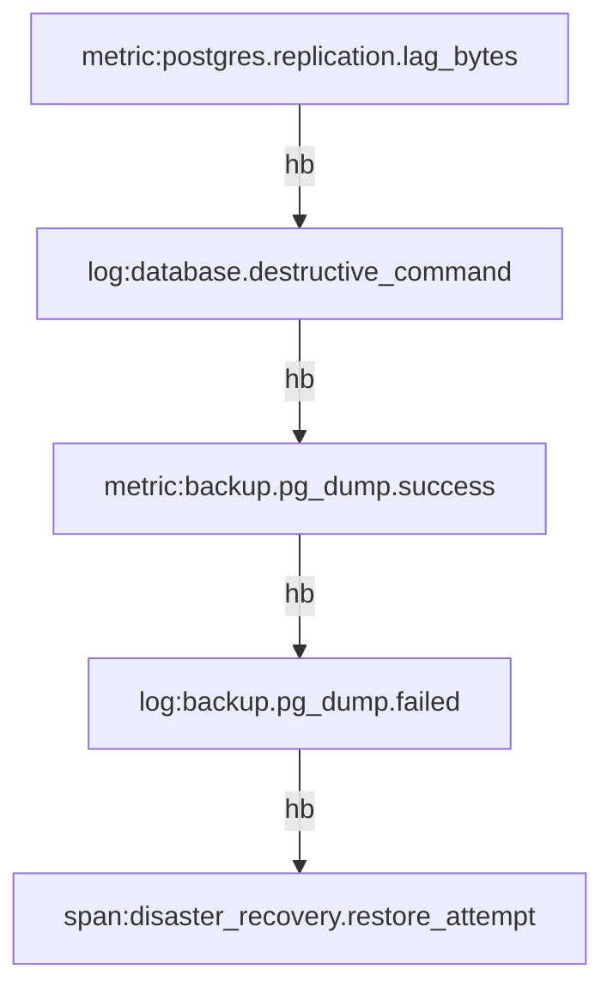

# Incident-readiness report: gitlab.com-database

- Owner: `unknown`
- Score: `96`
- Pass: `false`
- Events: 5
- Findings: 12
- Findings by code: `{"scenario.missing_field": 3, "telemetry.allowed_values": 4, "telemetry.missing_field": 3, "telemetry.numeric_max": 2}`

## Coverage

| Area | Score | Passed | Failed | Notes |
| --- | ---: | ---: | ---: | --- |
| Required evidence | 89 | 24 | 3 |  |
| Temporal coverage | 100 | 0 | 0 | no temporal_sequences declared |
| Correlation coverage | 100 | 0 | 0 | no correlation policy declared |
| Privacy risk | 100 | 1 | 0 | none |
| Remediation completeness | 100 | 12 | 0 |  |

## Unanswered incident questions

- `restore-readiness`: Can responders identify the intended host, actual host role, destructive command correlation id, backup health, alert delivery, and recovery source freshness?
  - Missing `scenario.missing_field` at `events[log=database.destructive_command].correlation_id`: scenario 'restore-readiness' cannot answer question without field 'correlation_id' on log 'database.destructive_command'
  - Missing `scenario.missing_field` at `events[log=database.destructive_command].command_guard_result`: scenario 'restore-readiness' cannot answer question without field 'command_guard_result' on log 'database.destructive_command'
  - Missing `scenario.missing_field` at `events[log=backup.pg_dump.failed].alert_delivered`: scenario 'restore-readiness' cannot answer question without field 'alert_delivered' on log 'backup.pg_dump.failed'

## Top remediations

- 4× `telemetry.allowed_values` (error, schema): Normalize the field to one of the declared allowed values.
- 3× `scenario.missing_field` (error, diagnosability): Emit the field needed to answer the scenario question.
- 3× `telemetry.missing_field` (error, diagnosability): Attach the required attribute/tag/field to the signal.
- 2× `telemetry.numeric_max` (error, schema): Investigate or clamp values above the declared maximum.

## Incident-window event-structure diagrams

- Nodes: 5
- Causal/happens-before edges: 4
- Concurrent span pairs: 0

### window-0 group all-observations

## Limitations

- Scores are computed from the supplied finite telemetry file and contract, not from production exhaustiveness.
- Historical case-study events are reconstructed fixtures when their metadata says so; findings bound answerability for this artifact only.

